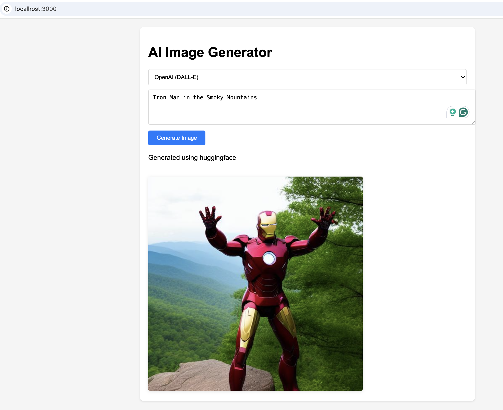
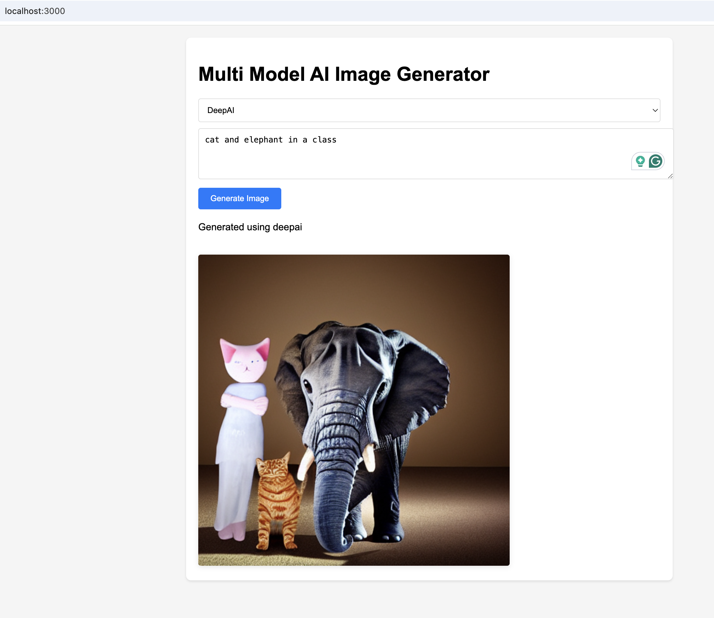
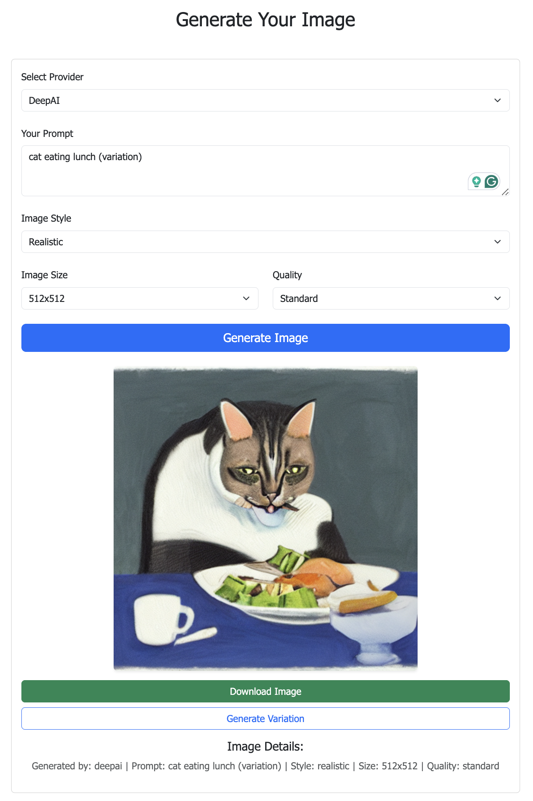

# Multi Model AI Image Generator using AI Gateway

A versatile AI image generation service that provides a unified interface to multiple AI image generation providers including OpenAI (DALL-E), Hugging Face (Stable Diffusion), MidJourney, and DeepAI.

## 🚀 Features

- Multiple AI Provider Support:
  - OpenAI (DALL-E)
  - HuggingFace (Stable Diffusion)
  - MidJourney
  - DeepAI
- Unified API Interface
- Automatic Fallback Mechanism
- Real-time Image Generation
- User-friendly Interface

## 🛠️ Setup

1. **Clone Repository**:
   ```bash
   git clone https://github.com/vgiri2015/myavatar.ai.git
   cd myavatar.ai
   ```

2. **Install Dependencies**:
   ```bash
   npm install
   ```

3. **Configure Environment**:
   Create a `.env` file with your API keys:
   ```env
   OPENAI_API_KEY=your_openai_key
   HUGGINGFACE_API_KEY=your_huggingface_key
   MIDJOURNEY_API_KEY=your_midjourney_key
   DEEPAI_API_KEY=your_deepai_key
   ```

   Get your API keys from:
   - OpenAI: https://platform.openai.com/account/api-keys
   - HuggingFace: https://huggingface.co/settings/tokens
   - MidJourney: https://docs.midjourney.com/docs/api-reference
   - DeepAI: https://deepai.org/dashboard/api-keys

4. **Start Server**:
   ```bash
   npm start
   ```

## 🎯 Usage

1. **Select Provider**:
   - Choose from available providers:
     - HuggingFace (Stable Diffusion)
     - OpenAI (DALL-E)
     - MidJourney
     - DeepAI
   - Each provider has different strengths and characteristics

2. **Enter Prompt**:
   - Be descriptive and specific
   - Include details about style, lighting, composition
   - Example: "Cat in the Eiffel Tower street"

3. **Generate Image**:
   - Click "Generate Image" and wait for the result
   - Generation typically takes 10-20 seconds
   - The UI will show a loading indicator during generation

## 🌟 Provider Comparison

### OpenAI (DALL-E)
- Best for: Realistic and artistic compositions
- Fast generation time
- Consistent quality
- Requires paid API credits

### HuggingFace (Stable Diffusion)
- Best for: Creative and artistic images
- Free tier available
- Good for experimentation
- May have longer generation times

### MidJourney
- Best for: Highly detailed artistic renderings
- Excellent at stylized artwork
- Strong with fantasy and concept art
- Requires API subscription

### DeepAI
- Best for: Quick prototypes and variations
- Simple API integration
- Good for basic image generation
- Free tier with rate limits

## 🖼 Sample Generated Images

Here are some examples of images generated using different providers:

### HuggingFace (Stable Diffusion)

*Prompt: "cat in the Eiffel Tower street"*

### OpenAI (DALL-E)

*Prompt: "Iron Man in the Smoky Mountains."*

### MidJourney

*Prompt: "Cyberpunk cityscape at sunset."*

### DeepAI

*Prompt: "Fantasy landscape with dragons."*

## 🔍 Troubleshooting

1. **Server Already Running**
   ```bash
   # Kill existing Node.js process
   pkill -f "node app.js"
   ```

2. **API Key Issues**
   - Verify keys in `.env` file
   - Check for whitespace in API keys
   - Ensure billing is set up for OpenAI
   - Verify HuggingFace token has proper permissions

3. **Generation Failures**
   - Check server logs for specific error messages
   - Verify network connectivity
   - Ensure prompt is appropriate and not too complex

## 🛠 Development

### Adding New Providers

1. Create new service in `services/providers/`
2. Implement required interface:
   ```javascript
   class NewProvider {
     async generateImage(prompt) {
       // Implementation
     }
   }
   ```
3. Register in `AIGateway.js`

### Project Structure
```
.
├── services/
│   ├── AIGateway.js              # Main gateway service
│   └── providers/                # Provider implementations
│       ├── OpenAIService.js      # DALL-E implementation
│       ├── HuggingFaceService.js # Stable Diffusion implementation
│       ├── MidJourneyService.js  # MidJourney implementation
│       └── DeepAIService.js      # DeepAI implementation
├── public/                       # Frontend assets
│   └── index.html               # Main UI
├── app.js                        # Express application
└── package.json                 # Project dependencies

## 📝 Notes

- OpenAI (DALL-E) has usage limits and requires billing setup
- HuggingFace is free but might be slower
- MidJourney requires API subscription
- DeepAI has free tier with rate limits
- Keep prompts clear and specific for best results
- Image generation can take varying times depending on provider and complexity

## 🤝 Contributing

1. Fork the repository
2. Create your feature branch (`git checkout -b feature/amazing-feature`)
3. Commit your changes (`git commit -m 'Add some amazing feature'`)
4. Push to the branch (`git push origin feature/amazing-feature`)
5. Open a Pull Request

## 📄 License

This project is licensed under the MIT License - see the LICENSE file for details.
